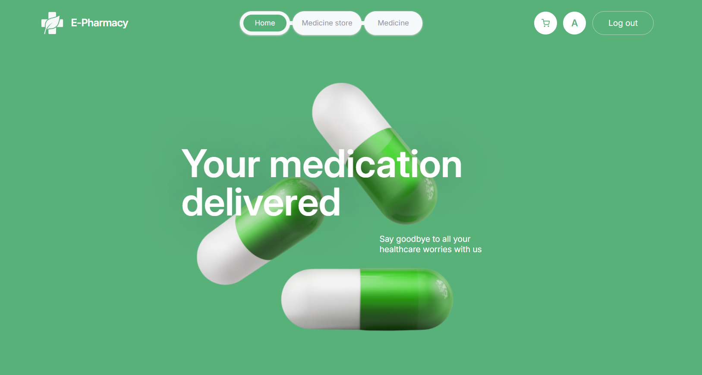

 <h1>E-Pharmacy</h1>

<h2>The website for buying medicine.</h2>
 

 <h1>About project:</h1>
 <h2><a href="https://www.figma.com/file/qrKzOBVqM6zOZNFkTOpEO0/E-PHARMACY-(clients)?type=design&node-id=0-1&mode=design&t=O9kTuPJAS2bjEuwM-0">Layout</a></h2>
 <h2><a href="https://docs.google.com/spreadsheets/d/1TdZTkbTSEcscopFAAH1XiiAbkP8IOawIugpvaG9xnuw/edit?gid=0#gid=0">Technical task</a></h2>
  <h2><a href="https://github.com/Annazubakha/E-Pharmacy-back">Back-end part</a></h2>
<h3>For unauthorized users:</h3>
<ul><li>Ability to login and register; </li>
<li>Ability to view lists of the stores and medicine;</li>
<li>Ability to filter medicine by category and search by key word.</li>
</ul>
<h3>For authorized users:</h3>
<ul><li>Ability to add products to the cart; </li>
<li>Ability to make order.</li>
</ul>
 <h1>Used technologies:</h1>
 

 &nbsp;
   &nbsp;
  &nbsp;
  &nbsp;
  &nbsp;
  &nbsp;
    &nbsp;
        &nbsp;
        &nbsp;
         &nbsp;
         &nbsp;
          &nbsp;
  

